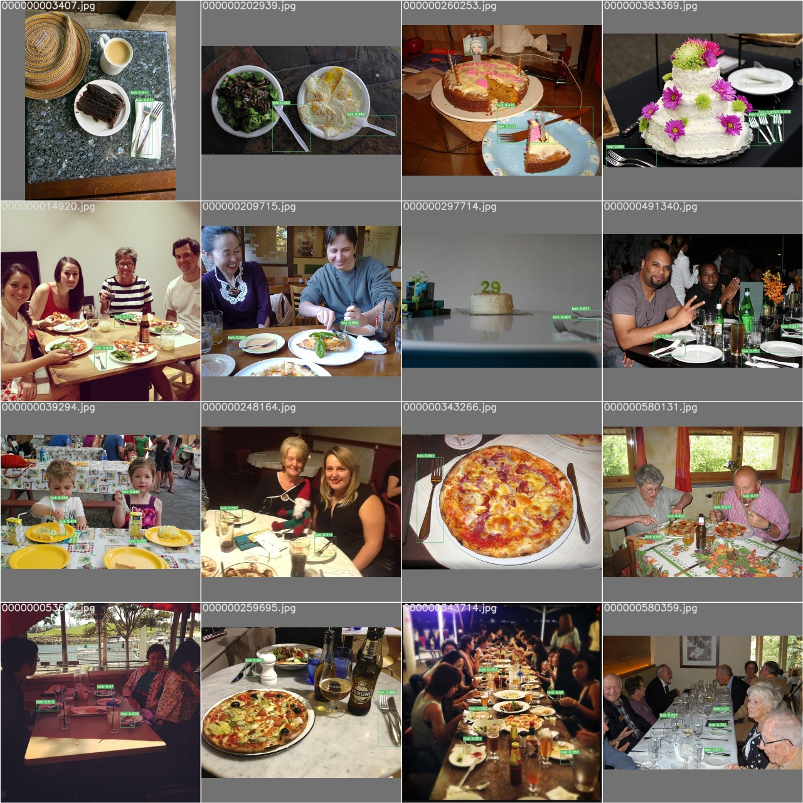

# LARA-2022_Fork-Detection

Este repositório contém o código para treinamento de uma rede neural [YOLOv7](https://github.com/WongKinYiu/yolov7) para detecção de garfos a partir do fine-tuning de um modelo pré-treinado no dataset COCO 2017.

## Dados do treinamento

O modelo foi treinado no ambiente Google Colab utilizando a GPU disponível para as contas gratuitas ao longo de 100 épocas. As imagens para treinamento, validação e teste foram filtradas a partir do [dataset COCO 2017](https://cocodataset.org/#home) e totalizam 3555 imagens para treino, 155 para validação e 427 para teste. Os hiperparâmetros e arquivos de configuração utilizados podem ser encontados na pasta [yolov7](yolov7/). Ao final do treinamento, o modelo obteve AP<sub>50:5:95</sub> igual a **50,4%** e AP<sub>50</sub> igual a **73,5%**, cerca de 4% e 8% maiores que o modelo original para a classe garfo.

## Configuração

- Versão do Python: 3.10.7
- Versão do PyTorch: 1.13.1

### Ambiente de desenvolvimento

1. Crie o ambiente de desenvolvimento
```bash
python -m venv pFD
```

2. Ative o ambiente de desenvolvimento
    - Em ambiente Windows (bash do git)
    ```bash
    source pFD/Scripts/activate
    ```
    
    - Em ambiente Linux
    ```bash
    source pFD/bin/activate
    ```

3. Instale as dependências
```bash
pip install -r requirements.txt
```

### Imagens para treinamento e validação

1. Siga as instruções da pasta [coco_manager](utils/coco_manager/) para baixar as anotações e filtrá-las por categoria;

2. Siga as instruções da pasta [download_images](utils/download_images/) para baixar as imagens filtradas;

3. Siga as instruções da pasta [coco2yolo](utils/coco2yolo/) para converter as anotações para o formato utilizado no modelo YOLOv7.

**Observação**: O código da pasta [images_exploration](utils/images_exploration/) pode ser utilizado para visualizar as imagens do dataset com as anotações das *bounding boxes*.

## Como usar

### Treinamento

1. Baixe os pesos pré-treinados (yolov7.pt, fork_best.pt ou fork_last.pt) para a pasta [models](models/).

2. Troque para a pasta [yolov7](yolov7/) e inicie o treino do modelo
```bash
python train.py --workers 4 --device 0 --batch-size 16 --cfg cfg/training/yolov7_custom.yaml --data data/coco_custom.yaml --epochs 100 --img 640 640 --hyp data/hyp_custom.yaml --name yolov7-fork --weights models/yolov7.pt --project .
```

**Observação**: Mais informações sobre os parâmetros do treinamento podem ser encontradas no repositório do modelo ou na pasta [yolov7](yolov7/).

3. Caso o treino seja interrompido, execute
```bash
python train.py --resume yolov7-fork/weights/last.pt
```

### Exportar modelo

Na pasta [yolov7](yolov7/), execute

```bash
python export.py --img-size 640 640 --grid --end2end --weights yolov7-fork/weights/best.pt --topk-all 100 --max-wh 640 --device 0 --dynamic-batch
```

**Observação**: Mais informações sobre outras operações, como testar e inferir, podem ser encontradas no repositório do modelo ou na pasta [yolov7](yolov7/).

### Inferência com ONNX

No diretório principal, execute

```bash
python detect.py --model [MODEL] --input [INPUT]
```

**MODEL**: Caminho para o modelo ONNX; e

**INPUT**: Caminho para a imagem ou para a pasta com as imagens.

- Outros argumentos:

    --batch: Tamanho do *batch*. **Valor padrão: 1**;
    
    --save: *flag* para salvar a imagem após inferência. **Valor padrão: False**;
    
    --dontshow: *flag* para não mostrar a imagem após inferência. **Valor padrão: False**; e

    --cuda: *flag* para utilizar GPU. **Valor padrão: False**.

- Exemplo

```bash
python detect.py --model models/fork_best_640x640.onnx --input data/test
```

## Resultados

### Métricas

Valores obtidos para as métricas *Precision* (P), *Recall* (R), AP<sub>50</sub> e AP<sub>50:5:95</sub> para os modelos yolov7 considerando todas as classes, yolov7 somente a classe garfo e modelo treinado (yolov7-fork).

|      Modelo     |     P     |     R     | AP<sub>50</sub> | AP<sub>50:5:95</sub> |
|:---------------:|:---------:|:---------:|:---------------:|:--------------------:|
|  yolov7 (todas) |   72,6%   |   64,6%   |      69,1%      |         49,7%        |
|  yolov7 (fork)  |   72,9%   |   63,3%   |       68%       |         48,3%        |
| **yolov7-fork** | **79,9%** | **68,4%** |    **73,5%**    |       **50,4%**      |

### Predições

Os resultados das predições podem ser visto individualmente na pasta [images](images/).



## Referências

- [YOLOv7: Trainable bag-of-freebies sets new state-of-the-art for real-time object detectors](https://arxiv.org/abs/2207.02696);
- [Official YOLOv7](https://github.com/WongKinYiu/yolov7);
- [Common Objects in Context dataset](https://cocodataset.org/#home).